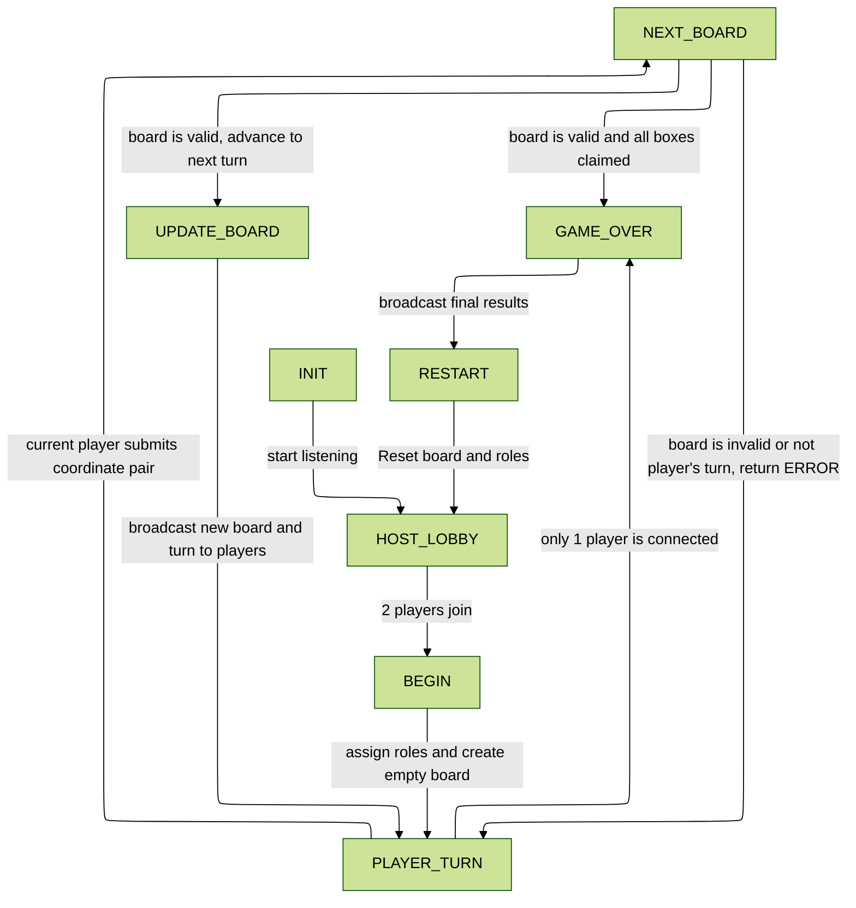

```mermaid
---
config:
  look: classic
  theme: forest
  layout: elk
---
flowchart TB
    A["INIT"] -- start listening --> B["HOST_LOBBY"]
    B -- 2 players join --> C["BEGIN"]
    C -- assign roles and create empty board --> D["PLAYER_TURN"]
    D -- current player submits coordinate pair --> E["NEXT_BOARD"]
    E -- board is valid, advance to next turn --> H["UPDATE_BOARD"]
    H -- broadcast new board and turn to players --> D
    E -- board is invalid or not player's turn, return ERROR --> D
    E -- board is valid and all boxes claimed --> F["GAME_OVER"]
    D -- only 1 player is connected --> F
    F -- broadcast final results --> G["RESTART"]
    G -- Reset board and roles --> B
```

In case Mermaid renders it unreadably for some reason, be sure to check out the PNG of the better layout.