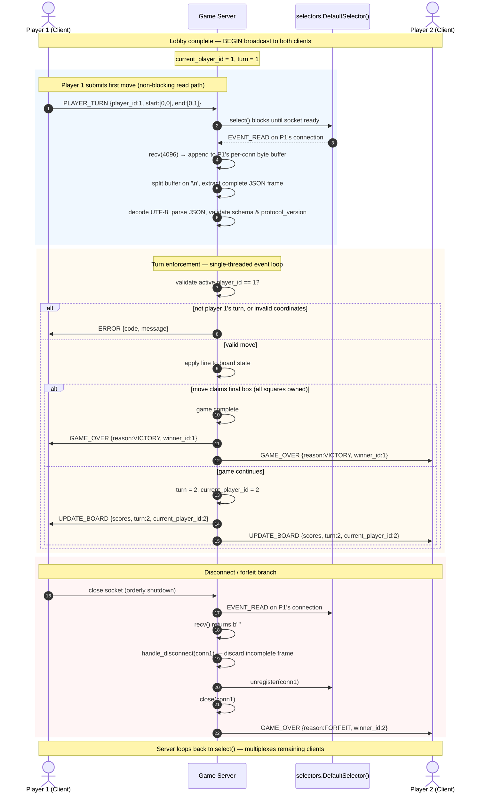

```mermaid
sequenceDiagram
    autonumber
    actor P1 as Player 1 (Client)
    participant SRV as Game Server
    participant SEL as selectors.DefaultSelector()
    actor P2 as Player 2 (Client)

    note over P1, P2: Lobby complete — BEGIN broadcast to both clients
    note over SRV: current_player_id = 1, turn = 1

    rect rgb(240, 248, 255)
        note over P1, SRV: Player 1 submits first move (non-blocking read path)
        P1->>SRV: PLAYER_TURN {player_id:1, start:[0,0], end:[0,1]}
        SRV->>SEL: select() blocks until socket ready
        SEL-->>SRV: EVENT_READ on P1's connection
        SRV->>SRV: recv(4096) → append to P1's per-conn byte buffer
        SRV->>SRV: split buffer on '\n', extract complete JSON frame
        SRV->>SRV: decode UTF-8, parse JSON, validate schema & protocol_version
    end

    rect rgb(255, 250, 240)
        note over SRV: Turn enforcement — single-threaded event loop
        SRV->>SRV: validate active player_id == 1?
        alt not player 1's turn, or invalid coordinates
            SRV->>P1: ERROR {code, message}
        else valid move
            SRV->>SRV: apply line to board state
            alt move claims final box (all squares owned)
                SRV->>SRV: game complete
                SRV->>P1: GAME_OVER {reason:VICTORY, winner_id:1}
                SRV->>P2: GAME_OVER {reason:VICTORY, winner_id:1}
            else game continues
                SRV->>SRV: turn = 2, current_player_id = 2
                SRV->>P1: UPDATE_BOARD {scores, turn:2, current_player_id:2}
                SRV->>P2: UPDATE_BOARD {scores, turn:2, current_player_id:2}
            end
        end
    end

    rect rgb(255, 245, 245)
        note over P1, P2: Disconnect / forfeit branch
        P1->>SRV: close socket (orderly shutdown)
        SRV->>SEL: EVENT_READ on P1's connection
        SRV->>SRV: recv() returns b""
        SRV->>SRV: handle_disconnect(conn1) — discard incomplete frame
        SRV->>SEL: unregister(conn1)
        SRV->>SRV: close(conn1)
        SRV->>P2: GAME_OVER {reason:FORFEIT, winner_id:2}
    end

    note over P1, P2: Server loops back to select() — multiplexes remaining clients
```